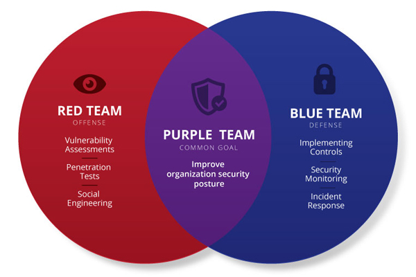

# Fundamentals

## Definition of ethical hacking

The term ethical hacking is used in the field of cybersecurity to refer to an authorized intrusion test on a company's systems and networks in a controlled manner. The goal of ethical hacking is to identify threats and vulnerabilities in systems that a malicious attacker could find and exploit, potentially causing significant damage.

## Types of audits

There are different types of penetration tests that can be performed, based on **where they are conducted**, the **information available**, and the **type of attack being simulated**.

### Black box

A black box audit is highly demanded because it simulates a **real attack by a malicious hacker**.  
In this type of audit, the tests are usually performed remotely and the professional is not provided with any technical documentation, network maps, or system user information.

Since no prior information is available, it is very important to strictly follow the phases of a penetration test and to be **highly organized when collecting information and gathering evidence** as it is discovered.

### White box

This is the stage where the auditor has **more work**, but also **higher chances of success** during the penetration test. In a white box audit, all the necessary information to carry out the intrusion test is provided, including users with different privilege levels, network maps, firewalls, applications, etc.

This type of test usually takes longer, as it requires analyzing many components of the infrastructure, as well as performing an **exhaustive software assessment**, including code review and analysis of installed system versions.

### Gray box

A gray box audit lies between a white box audit and a black box audit.  
These assessments are usually conducted **partially remotely and partially on the client’s premises**, so that it can be tested the external infrastructure without neglecting the company’s internal security.

The auditor is provided with infrastructure data, user accounts (usually without privileges), general information about the applications under analysis, and specific instructions regarding the components to be tested.

Internal attacks or data leaks are often caused by **disgruntled employees** who have access to infrastructure information and system access, typically with limited user privileges. This provided information allows the auditor to better understand the infrastructure, making the penetration test easier; however, it must also be taken into account that there are **more components that need to be analyzed**.

## Team dynamics

**Red team** refers to the group of people who perform **ethical hacking activities**. This team is made up of **security professionals** who act as **adversaries** to plan and bypass an organization's cybersecurity controls.

With the goal of generating **competitiveness** and improving the **security performance** of an organization, the concept of the **blue team** was created. This team serves as the **antithesis** of the red team, and its objectives are based on **protecting critical assets** of the organization against any type of threat, through practices such as: **auditing the network, setting up firewalls, installing security software**, etc.

However, although **red and blue teams share common objectives**, they are often **not politically aligned**. For example, red teams that report vulnerabilities are **praised for a job well done**, so they are **not incentivized** to help the blue team strengthen security by sharing information on how they bypassed defenses.

This is where the concept of the **purple team** comes into play. The goal of a purple team is to **bring Red and blue teams together**, encouraging them to **collaborate**, **share knowledge**, and create a **strong feedback loop**.

