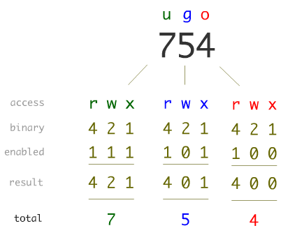

# Privilege escalation

## Windows Operating Systems

Escalating privileges in Windows requires a deep understanding of its Access Control Model.

### Key Theoretical Concepts

- **Sessions**: Windows is a multi-user system, meaning multiple users can have simultaneous sessions. Each session encapsulates relevant access data, such as permissions and login characteristics.


- **Security Identifier (SID)**: Every user or security entity is assigned a unique SID (e.g., S-1-5-32-545) so the system can identify and trust them.


- **Access Tokens**: These objects describe the security context of a process or thread. Created at login, they identify the user, their groups, and specific privileges.


- **Security Descriptors (SD)**: These contain security information for "securable objects" (like files or registry keys). An SD includes the owner's SID and two types of Access Control Lists (ACLs):


    - **DACL (Discretionary ACL)**: Specifies which users or groups are allowed or denied specific access rights.


    - **SACL (System ACL)**: Controls which access attempts generate entries in the security audit logs.


- **Access Check**: This mechanism compares a user's Access Token against an object's Security Descriptor to decide if access should be granted.


- **Integrity Levels**: Introduced in Windows Vista, these labels restrict the interaction between processes of different trust levels:


    1. **Untrusted**: For anonymous processes.


    2. **Low**: Used for internet interaction (e.g., browsers); these processes are highly restricted from writing to the system or user profile.


    3. **Medium**: The default level for standard users and most objects.


    4. **High**: Reserved for administrators (requires "Run as Administrator").


    5. **System**: Reserved for the Windows kernel and core services.

## UNIX Operating Systems

Linux privilege escalation is generally considered less complex technically but follows the same functional methodology.

### Key Theoretical Concepts

#### Users and gropus
Every user has a unique UID (user identifier), and groups have a GID (group identifier). The UID 0 is strictly reserved for the root (superuser).

#### File permissions

In contrast to the Access Control Lists from Windows, Unix has its own file permission model, often called UGO. This model associate each file with three categories of users:

- **User (U)**: The user owner of the file.

- **Group (G)**: Users who belong to the file’s assigned group.

- **Others (O)**: All remaining users on the system.

For each category, three types of permissions can be granted:

- **Read (r)**: Allows viewing the contents of a file or listing a directory.

- **Write (w)**: Allows modifying or deleting a file, or creating/removing files in a directory.

- **Execute (x)**: Allows executing a file as a program or accessing a directory.

Permissions are typically represented in symbolic form (e.g., `rwxr-xr--`) or numeric (octal) form (e.g., `754`). This simple model forms the foundation of access control in Unix-like systems and can be managed using tools such as `chmod`, `chown`, and `chgrp`.



In addition to the UGO permissions, there is a special permission option for each category of users discussed previously:

- **Setuid (SUID)**: A file with SUID always executes with the permissions of the user who owns the file, regardless of the user passing the command.

```sh
[oscar-sr@server ~]$ ls -l /usr/bin/passwd 
-rwsr-xr-x. 1 root root 33544 Dec 13  2019 /usr/bin/passwd
```

- **Setgid (SGID)**: If set on a file, it allows the file to be executed with the permissions of the group that owns the file (similar to SUID). If set on a directory, any files created in the directory will have their group ownership set to that of the directory owner.

```sh
[oscar-sr@server article_submissions]$ ls -l 
total 0
drwxrws---. 2 oscar-sr oscar-sr  69 Apr  7 11:31 my_articles
```

- **Sticky bit**: This permission does not affect individual files. However, at the directory level, it restricts file deletion. Only the owner (and root) of a file can remove the file within that directory.

```sh
[oscar-sr@server article_submissions]$ ls -ld /tmp/
drwxrwxrwt. 15 root root 4096 Sep 22 15:28 /tmp/
```

#### Critical files

- `/etc/passwd`: Stores user configurations, including UIDs, GIDs, home directories, and default shells. Passwords of each user are usually not stored here, and this is indicated with an `x` in the corresponding field. However, from this file, we can establish a new encrypted password for a user if we change the `x` of this field, ignoring if it the previous password was stored in other file.

- `/etc/shadow`: Stores encrypted passwords and is typically only readable by the root user.

#### Process privileges

Processes normally run with the privileges of the user who started them. However, special permissions like setuid or setgid allow a program to run with the privileges of the file's owner or group, which is a common vector for escalation.

#### User ID types

- **Real User ID**: The ID of the user who initiated the process.

- **Effective User ID**: The ID actually used by the kernel to validate permissions. If this is changed to 0, the process gains root privileges.

- **Saved set-user-ID**: Used when a program is configured with the setuid bit.